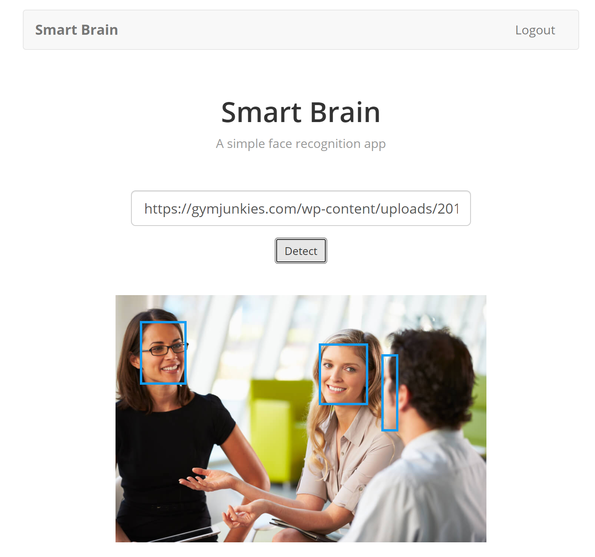

# Smart Brain Client

A web app that locates human faces in a picture.



## Introduction

This is the front-end part of the app. The code for back-end part is [here](https://github.com/kingyiusuen/smart-brain-api). 

The app allows users to input a URL that links to an image and locate the faces that appear in the image with bounding boxes. The API for the face detection algorithm is provided by [Clarifai](https://www.clarifai.com/). 

The full version of the app is deployed on [Heroku](https://smart-brain-ksuen.herokuapp.com/). It requires registration before use. If you want to play around without registering, you can use the following example acount:

```
email: test@example.com
password: thisisatest
```

## Technologies Used

- HTML
- CSS
- Javascript (Node.js)

## Notes

This project was mostly planned out by an instructor in Udemy course. However, I made a few modifications:

- Used React Bootstrap to style the app myself
- Used React Router to keep the UI in sync with the URL
- Created a custom 404 error page
- Created multiple bounding boxes for images with more than one face

## Future Improvements

- Store the previously inputted URLs of each user and display them in a profile page
- Persist the users' login status so that they won't get logged out after refreshing
- Prevent logged in users to access the login page and sign up page
